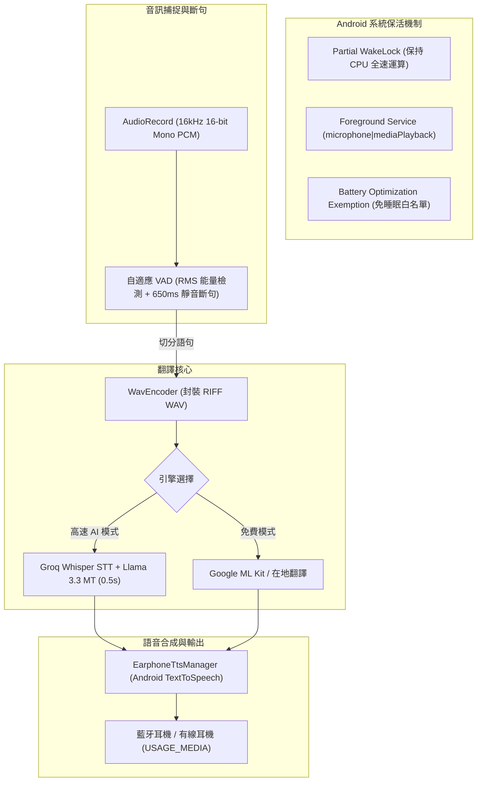

# 隨身口譯 (Pocket Translator) — 支援手機關閉螢幕即時語音翻譯

> 一款如同 **Google 翻譯即時語音對話 / 同聲傳譯** 的 Android 應用程式，並徹底解決了 Google 翻譯**「按下電源鍵鎖定或關閉螢幕後就自動中斷錄音與口譯」**的最大痛點！

---

## ✨ 核心特色與使用場景

### 1. 🎧 關閉手機螢幕，持續在耳機聽即時翻譯
* **真正支援背景與熄屏收音**：點擊開始後，直接按下手機電源鍵關閉螢幕，放進胸前口袋或背包，戴著藍牙耳機即可持續聆聽現場外語演講、外語影片或旁人交談，耳機會自動朗讀繁體中文口譯。
* **超長效 Doze 模式穿透**：透過 Android 原生 `ForegroundService` + `PARTIAL_WAKE_LOCK` + 系統通知列保活，即使螢幕關閉休眠，CPU 依然全速處理音訊與即時口譯。

### 2. 🔄 雙模式自由切換
* **【單向即時同傳模式】**：
  * 適合場景：聽外語演說、看國外 YouTube/Podcast、參觀國外博物館、走在路上聽旁人交談。
  * 外語（日語/英語/韓語等）輸入 ➔ 繁體中文即時口譯 ➔ 定向播放至耳機，手機喇叭保持靜音。
* **【雙向對話交談模式】**：
  * 適合場景：出國旅行點餐、購物詢價、海關問答、商務交談。
  * 一鍵交換發話方：我說中文 ➔ 手機外放外語給對方聽；對方說外語 ➔ 耳機朗讀中文給我聽。

### 3. ⚡ 雙引擎混合架構
* **極速 AI 引擎（推薦）**：支援填入 **Groq Whisper** (`whisper-large-v3-turbo`) + **Llama 3.3 / Gemini**，整體 STT + 翻譯反應速度約 **300ms ~ 600ms**，體驗近乎同聲口譯！
* **免金鑰免費模式**：支援 Android 原生 Google 語音與 ML Kit 離線神經網路翻譯，不需註冊或填寫任何 API 金鑰即可使用。

### 4. 🕶️ AMOLED 純黑極致省電防誤觸模式
* 若不想實體關閉電源，可啟動內建純黑 OLED 遮罩模式，螢幕像素全滅不發光且防口袋誤觸，雙擊螢幕任意處即可一秒返回主畫面。

---

## 📱 下載與安裝指南

### 方法一：直接線上下載編譯好的 APK（最推薦）
本專案已整合 **GitHub Actions 自動編譯工作流程**：
1. 進入本 GitHub 儲存庫頁面。
2. 點擊頂部 **「Actions」** 分頁。
3. 點擊最新的 **「Build Android APK」** 執行紀錄。
4. 在最下方的 **「Artifacts」** 區塊點擊下載 `PocketTranslator-Debug-APK`。
5. 解壓縮後將 `.apk` 傳送至手機點擊安裝即可！

### 方法二：本機自行編譯
若本機已安裝 Android Studio 或 Java 17：
```bash
# 複製專案
git clone https://github.com/rock903400-byte/pocket-translator.git
cd pocket-translator

# 執行單元測試
./gradlew test

# 編譯 Debug APK
./gradlew assembleDebug

# 安裝至手機 (需連接 ADB)
adb install app/build/outputs/apk/debug/app-debug.apk
```

---

## ⚙️ 關鍵手機設定建議（必看！）

為了確保 Android 系統在**螢幕完全熄滅關閉且放入口袋 10 分鐘以上**時，不會因為廠商激進的省電機制而強制殺死麥克風錄音，請依照以下步驟設定：

1. **授予麥克風權限**：首次啟動 App 請務必選擇「使用應用程式時允許」或「一律允許」。
2. **允許常駐通知**：Android 13+ 請允許發送通知（前台服務需要常駐通知維持錄音）。
3. **電池用量設為「不受限制」**：
   - 到手機「設定」➔「應用程式」➔「隨身口譯 (Pocket Translator)」。
   - 點選「電池」➔ 將設定由「已最佳化」改為 **「不受限制 (Unrestricted)」**。
4. **藍牙耳機連線**：戴上藍牙耳機（如 AirPods, Galaxy Buds, Sony 等），確認手機已連線至耳機，語音翻譯將優先傳入耳機。

---

## 🔑 如何獲取免費 Groq API Key（獲得 0.5 秒極速口譯體驗）

Groq 提供極為充裕的免費額度，反應速度是傳統 API 的 5~10 倍：
1. 前往 [Groq Console](https://console.groq.com/) 註冊免費帳號。
2. 點擊左側 **API Keys** ➔ **Create API Key**。
3. 複製產生的金鑰（以 `gsk_` 開頭）。
4. 打開「隨身口譯」App，點擊右上角 **⚙️ 設定** 圖示，貼上金鑰並儲存。
5. 即刻享受 0.5 秒同步口譯體驗！

---

## 🛠️ 系統技術架構



---

## 📄 開源授權

本專案採用 [MIT License](LICENSE) 授權。
